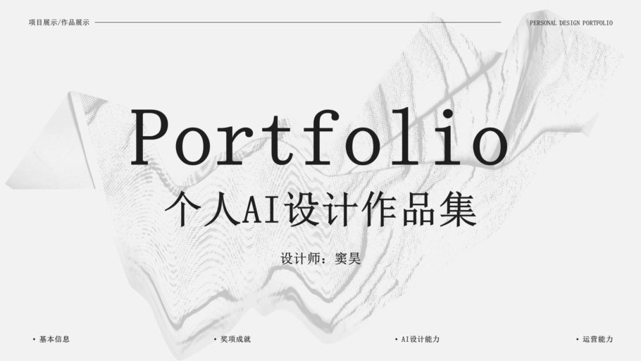
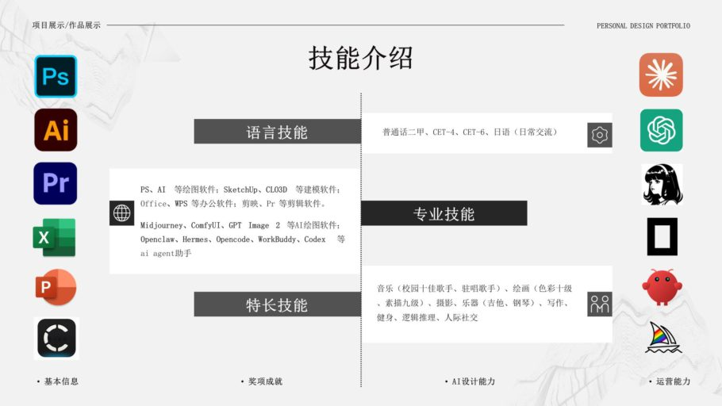
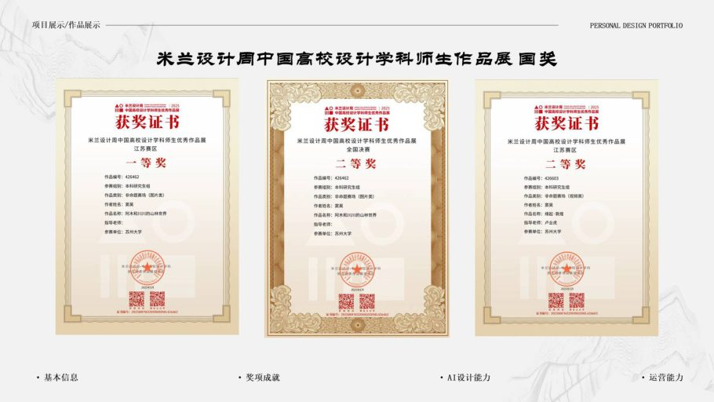
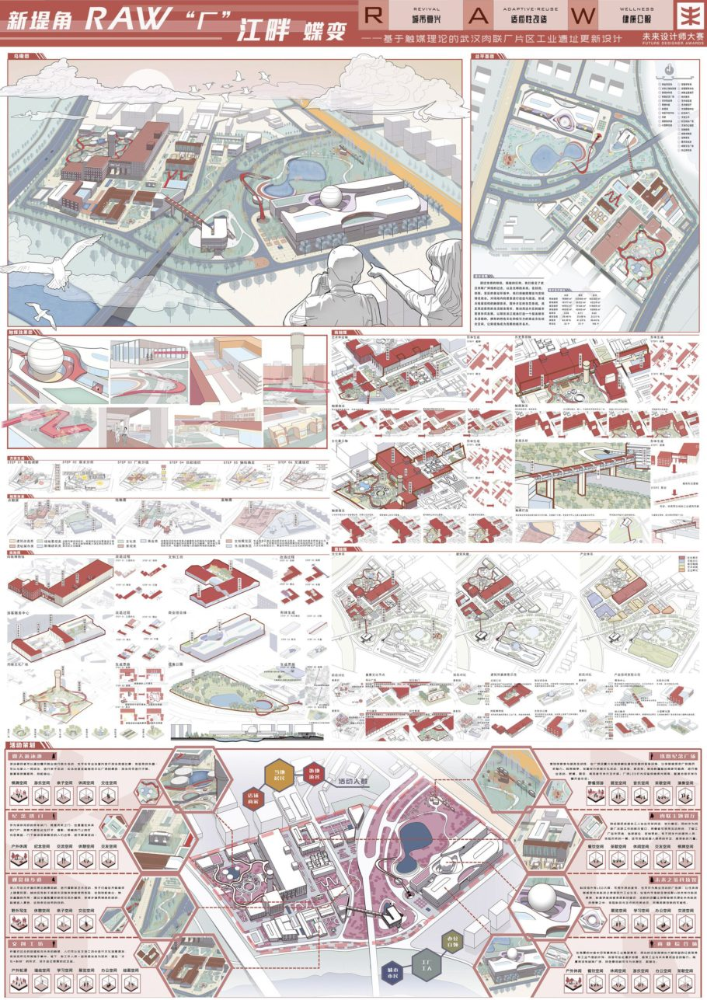
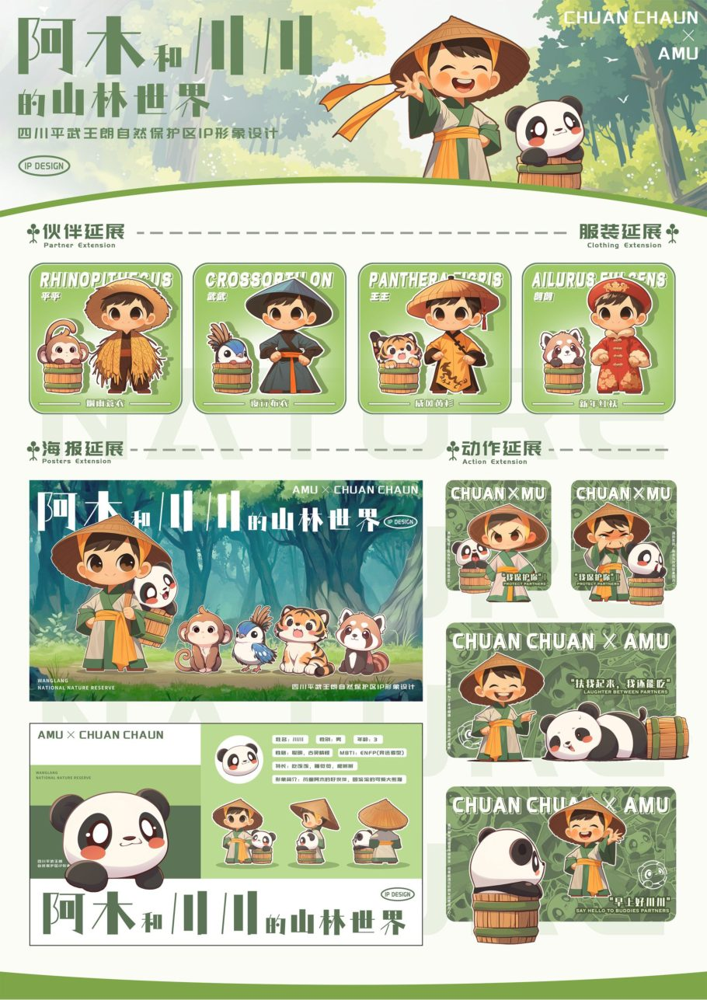
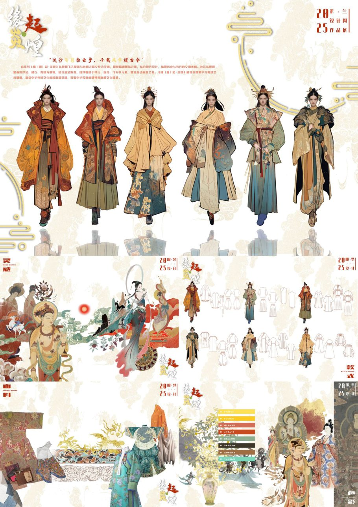
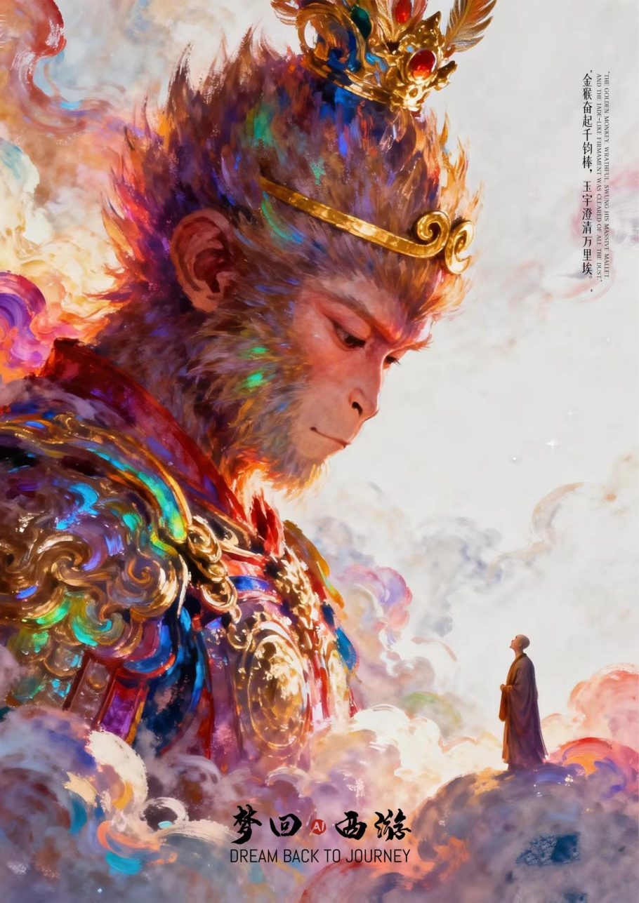
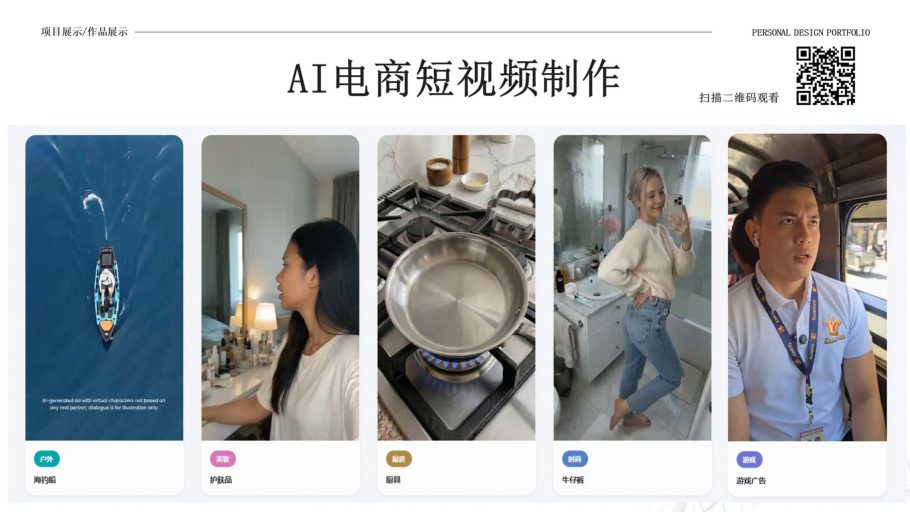
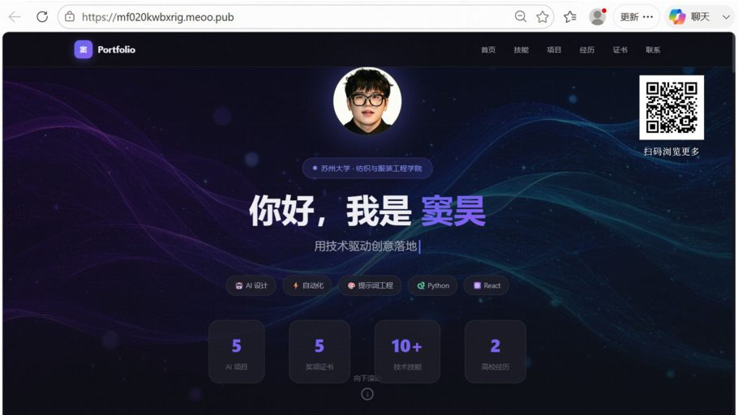

# AI 设计作品集 · 窦昊

> AIGC + 视觉设计 / 纺织服装工程硕士 · 苏州大学

[-c8102e)](./AI设计作品集_窦昊.pdf)

---

## 关于我

| | |
|---|---|
| **姓名** | 窦昊 |
| **年龄** | 24 岁 |
| **民族** | 汉族 |
| **MBTI** | ENFJ |
| **最高学历** | 硕士（苏州大学 · 纺织服装工程） |
| **本科** | 华中农业大学 · 风景园林（211） |
| **学生工作** | 班长 / 学生会部长 / 社团长 |

热爱音乐、绘画与摄影，AIGC 深度使用者。熟悉 Midjourney、ComfyUI、GPT Image 2 等图像生成工具，并用 AI Agent（Hermes、OpenClaw、OpenCode、Codex）搭建过完整的内容生产与自动化工作流。

📄 **完整作品集（32 页）**：[`AI设计作品集_窦昊.pdf`](./AI设计作品集_窦昊.pdf)

---

## 目录

- [Part 01 · 基本信息](#part-01--基本信息)
- [Part 02 · 奖项成就](#part-02--奖项成就)
- [Part 03 · AI 设计能力](#part-03--ai-设计能力)
- [Part 04 · 运营能力](#part-04--运营能力)
- [预览图](#预览图)

---

## Part 01 · 基本信息

### 技能

**语言技能**
普通话二级甲等 · CET-4 · CET-6 · 日语（日常交流）

**专业技能**
- 设计：Photoshop、Illustrator、SketchUp、CLO3D
- 办公：Office、WPS
- 视频：剪映、Premiere
- **AIGC：Midjourney、ComfyUI、GPT Image 2**
- **AI Agent：Hermes、OpenClaw、OpenCode、WorkBuddy、Codex**

**特长技能**
音乐（校园十佳歌手、驻唱歌手）· 绘画（色彩十级、素描九级）· 摄影 · 乐器（吉他、钢琴）· 写作 · 健身 · 逻辑推理 · 人际社交

---

## Part 02 · 奖项成就

| 类别 | 奖项名称 | 级别 | 时间 |
|---|---|---|---|
| 竞赛 | 米兰设计周中国高校设计学科师生优秀作品展 | **全国决赛二等奖** / 江苏赛区一等奖 / 江苏赛区二等奖 | 2025.05 |
| 竞赛 | 中国好创意暨全国数字艺术设计大赛（第二十届）· 中国风传统文化类 | 江苏赛区（研究生组）二等奖 | 2026.08 |
| 竞赛 | 第 13 届未来设计师 · 全国高校数字艺术设计大赛 | 江苏赛区三等奖 | 2025 |
| 竞赛 | 2025 首届全国大学生人工智能时尚创新设计大赛 · 北疆文化赛道 | 优秀奖 | 2025.11 |
| 竞赛 | 职业生涯规划视频大赛 | 省级二等奖 | 2023.09 |
| 奖学金 | 苏州大学特等学业奖学金 | 校级特等奖 | 2025.12 |
| 奖学金 | 华中农业大学美育优秀奖 | 校级 | 2021.11 |
| 科研 | 大学生科技创新基金项目 SRF（基于生物多样性的城市景观灯光规划设计） | 结题合格 | 2023.06 |

**论文**

《桑蚕养殖管理技术及产业发展》（第一作者之一）被**《中国人民大学复印报刊资料》全文转载**，转载期刊《种植与养殖》2023 年第 13 期。

---

## Part 03 · AI 设计能力

### 🏙 人居环境设计

工业遗址更新设计《新堤角 RAW "厂"江畔蝶变》 —— 以 AI 辅助概念生成与效果图产出，完成从场地分析到空间叙事的完整方案。

### 🐿 虚拟 IP 设计

原创 IP 形象**「阿木与川川的山林世界」**——四川平武王朗自然保护区卡通形象设计，含角色造型、表情延展、换装系统与周边应用，并输出多比赛版本。

### 👘 AI 时尚设计

- 《缘起敦煌》——敦煌风服装设计系列
- 《隐》——中式水墨风格男装系列
- 《元域 · 风鸣》——草原文化主题 AI 辅助男装设计

### 🖼 AI 海报与插画

- 极简风格 AI 海报设计
- 《梦回西游》——AI 国风孙悟空系列插画

---

## Part 04 · 运营能力

- **自动驾驶内容矩阵** —— 覆盖 B 站、小红书的自媒体创作与运营
- **AI 短视频制作** —— 各品类电商广告短视频批量产出
- **海外电商 AI 短视频商单拓展** —— 商业分析 PPT 与投放策略
- **个人作品集网页** —— 从设计到上线的完整实现

---

## 预览图

| 封面 | 技能与 AI 工具 | 米兰设计周获奖 |
|---|---|---|
|  |  |  |

| 人居环境设计 | 虚拟 IP · 阿木与川川 | 服装设计 · 缘起敦煌 |
|---|---|---|
|  |  |  |

| AI 海报 · 梦回西游 | AI 电商短视频 | 作品集网页 |
|---|---|---|
|  |  |  |

---

## 相关链接

- 🤖 **AI 网申管家**（开源项目）：https://github.com/DOLOwithAI/ai-apply-manager
- 🎮 **AI 游戏作品集**：https://github.com/DOLOwithAI/ai-game-portfolio
- 👤 **GitHub 主页**：https://github.com/DOLOwithAI

---

© 2026 窦昊 · 本作品集内所有设计作品与图文内容版权归原作者所有，未经许可请勿转载或商用。
